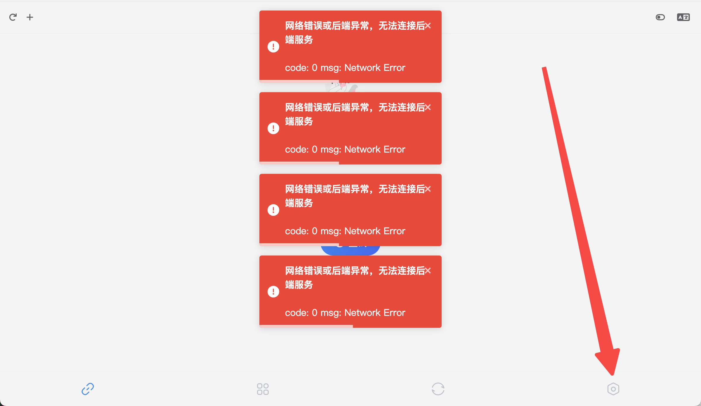
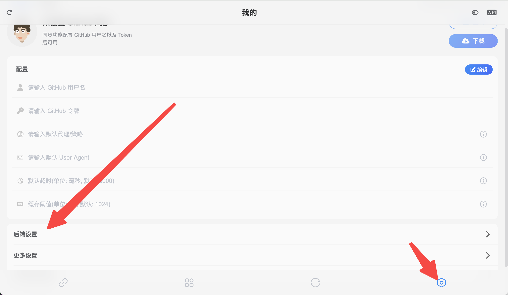
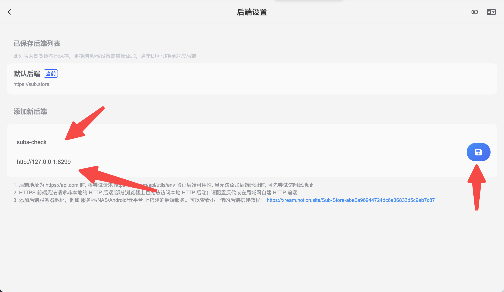
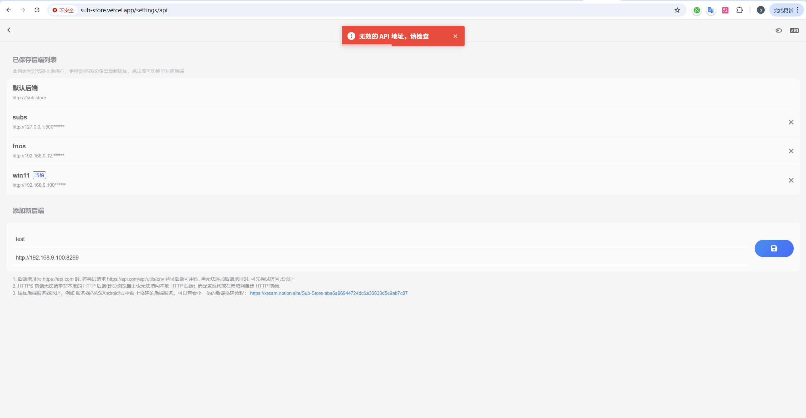
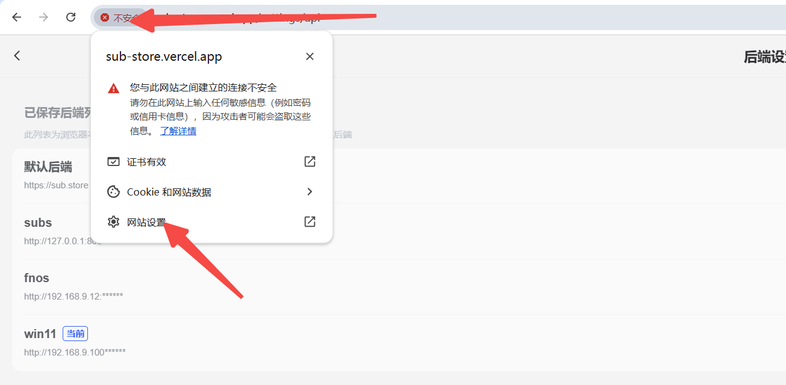
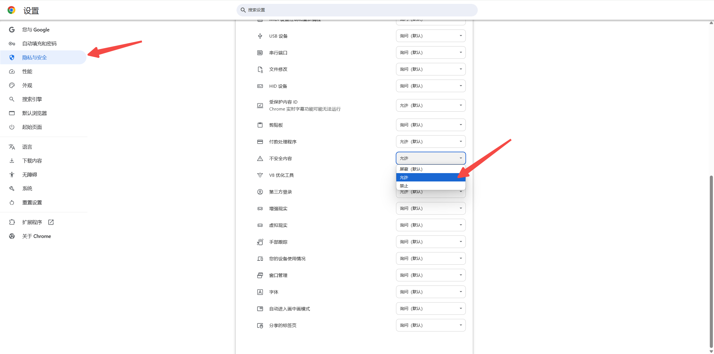
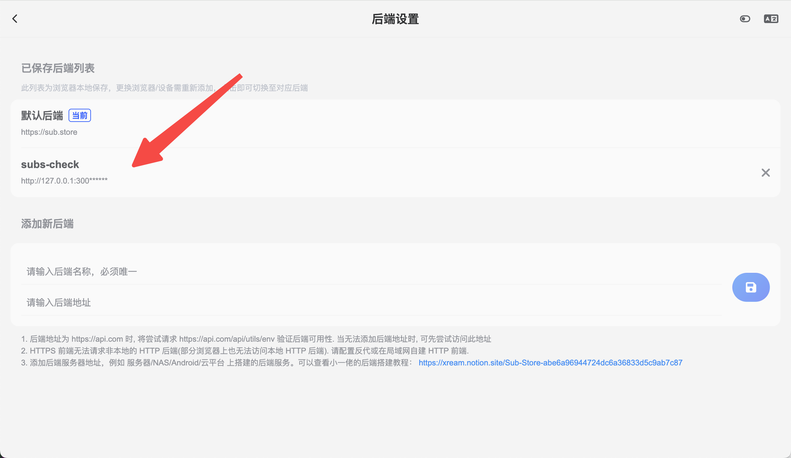
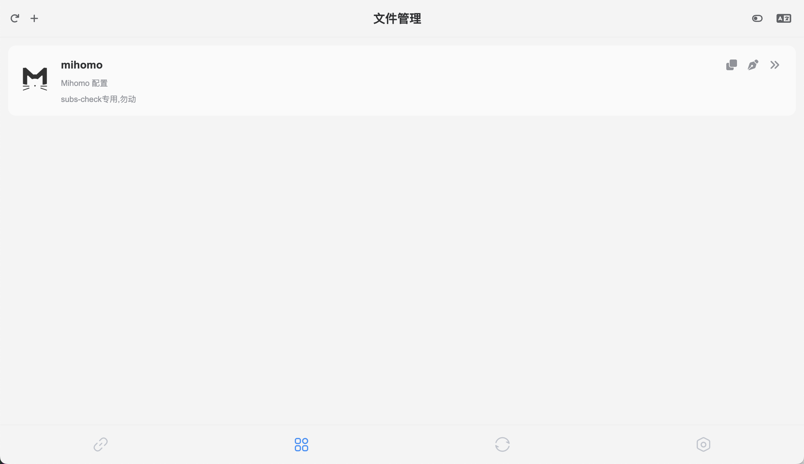

# sub-store 后端使用教程

> 当你打开`http://127.0.0.1:8299`，你发现跳转到了`https://sub-store.vercel.app/subs`

> 不要惊慌！不要惊慌！不要惊慌！

> 程序没有问题，你也没有问题，sub-store是一个前后端分离的项目，你直接访问了后端，他帮你跳转到了公开的前端页面。

> 所以你只需要配置一下，后端地址，你就可以直接操作后端了。
## 直接访问，会跳到这里
> 如果你网络不好，这个页面可能都打不开

## 右下角设置里，后端设置

## 填入名称和后端地址保存

## 正常应该会有错误（这是因为浏览器不允许https的前端访问http的后端）

> **chrome内核浏览器的解决方案** 其他浏览器也差不多是这种问题，自行谷歌解决方案

> 小一佬提供的解决方案： HTTPS 前端无法请求非本地的 HTTP 后端(部分浏览器上也无法访问本地 HTTP 后端). 请配置反代或在局域网自建 HTTP 前端.

## 切换到你添加的后端

## 订阅管理页面
> 那些不带规则的订阅就从这里出来的

## 文件管理页面
> 带规则的mihomo.yaml文件就从这里出来的

## 想要DIY？

在原基础上新建订阅或者文件，不要在subs-check专用的配置上修改！！！